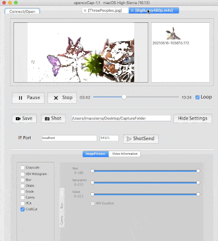

# OpenCap     
### OpenCV4 Capture Utility w/ QT5
 
Application for tuning OpenCV4 filters, with Qt5... 
  width=320>

 
 
 

## References  
  -[MultiThreaded OpenCV Capture](https://code.google.com/archive/p/qt-opencv-multithreaded/wikis/Documentation.wiki) OpenCV MultiThreaded Capture 
