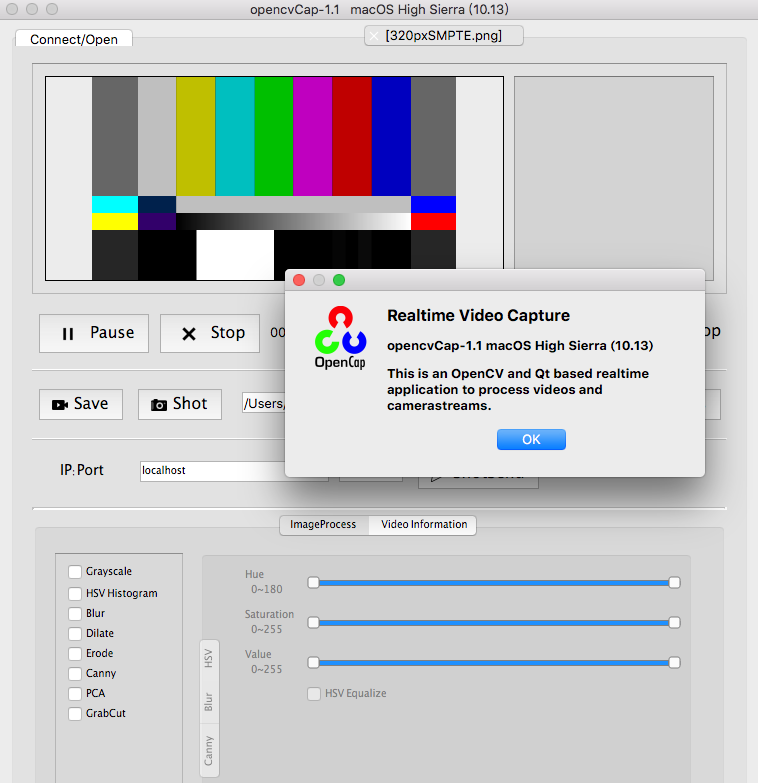
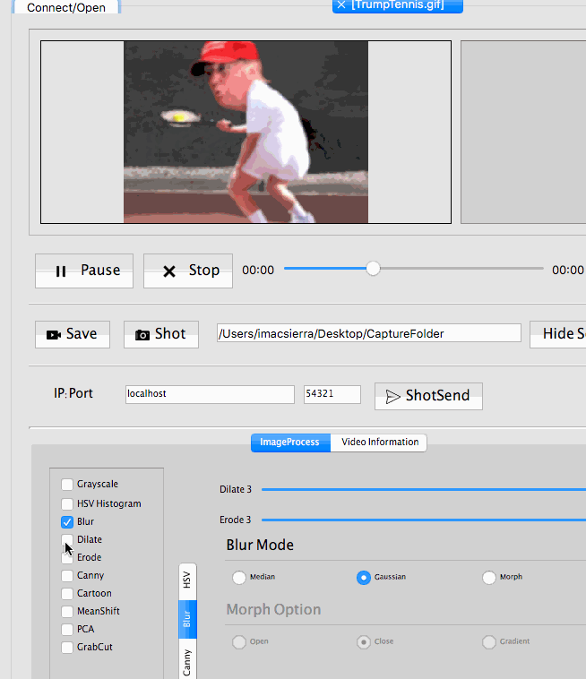

# OpenCap     
### OpenCV4 Capture Utility w/ QT5
 

#### Application for tuning OpenCV4 filters, with Qt5/Camera/Video/Image... 
Adjust your filters under main/helper/_ProcessingFrame.cpp...  
Option filters: Gray, Flip, Blur, Dilate, Erode, Canny, HSV segment/Histogram, MacBeth colorcheck, meanShift, PCA, GrabCut...  
Also adds TCPIP send capability for transfering pixmap via networks... 
   

 
 
 

## References  
  -[QtEVM](https://github.com/wzpan/QtEVM) Qt EVM.  
  -[RVM](https://github.com/tschnz/Live-Video-Magnification) Realtime Video Magnification.  
  -[RangeSlider](https://github.com/nasafix-nasser/Qt-RangeSlider/) TwoWay Qt RangeSlider.  
  -[OpenCV Multithread Capture](https://github.com/nickdademo/qt-opencv-multithreaded) MultiThreaded OpenCV capture!  
  -[MeanShift](http://qiankanglai.me/2012/03/19/meanshift/) Kanglai Qian: MeanShift filter/segmentation w/ OpenCV. 
